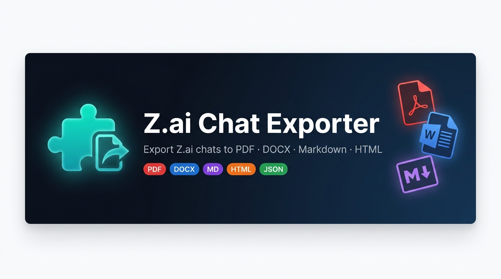

<p align="center">
  
</p>

<p align="center">
  <a href="https://github.com/md-aktaruzzman-emon/Z.ai-Chat-Exporter/releases"></a>
  
  
  
  
  
</p>

<h3 align="center">Export your Z.ai conversations to PDF, DOCX, Markdown, HTML, and more — all locally, with zero data leaving your browser.</h3>

---

## 📋 Table of Contents

- [✨ Features](#-features)
- [📤 Supported Export Formats](#-supported-export-formats)
- [🏗️ Architecture](#️-architecture)
- [⚙️ Installation](#️-installation)
- [🧪 Development](#-development)
- [⚠️ Known Limitations](#️-known-limitations)
- [🤝 Contributing](#-contributing)

---

## ✨ Features

| Feature | Description |
|---|---|
| 🔒 **100% Local & Private** | All rendering, parsing, and conversion runs entirely inside your browser. Zero telemetry, zero analytics, zero CDN calls. |
| 📄 **Vector PDF** | Selectable, searchable PDF via `pdf-lib`. Text is real text — not images. |
| 🖼️ **Raster PDF** | Full visual-fidelity PDF screenshot via `html2canvas + jsPDF`. Preserves charts, diagrams, colours. |
| 📝 **Word / DOCX** | Structured DOCX with proper headings, tables, code blocks, and embedded images via `docx.js`. |
| ⬇️ **Markdown (3 presets)** | GitHub-flavored (GFM), Obsidian callouts/wikilinks, and Notion paste-safe Markdown. |
| 🌐 **HTML Export** | Standalone self-contained HTML file with all styles inlined. |
| 📊 **Graphs & Diagrams** | SVG and canvas-rendered charts (Mermaid, Chart.js, etc.) are rasterized and embedded in PDF/DOCX. |
| 🧹 **PII Anonymizer** | Locally redacts emails, phone numbers, API keys, bearer tokens, and JWT credentials before export. |
| 🗂️ **Export History** | Optional local IndexedDB history cache with 200-entry LRU eviction — re-download past exports anytime. |
| 🌍 **Multi-Language** | Fully localized in English (`en`) and Bengali (`bn`). |

---

## 📤 Supported Export Formats

<p align="center">

| Format | Engine | Highlights |
|:---:|:---:|---|
| **PDF (Vector)** | `pdf-lib` | Selectable text, smallest file size |
| **PDF (Raster)** | `html2canvas` + `jsPDF` | Pixel-perfect, preserves all visuals |
| **DOCX** | `docx.js` | Editable Word document with full structure |
| **Markdown** | Built-in | GFM / Obsidian / Notion presets |
| **HTML** | Built-in | Self-contained, styles inlined |
| **TXT** | Built-in | Plain text, no formatting |
| **JSON** | Built-in | Raw conversation data structure |
| **PNG** | `html2canvas` | Full-page image, auto-split for large chats |
| **CSV** | Built-in | Spreadsheet-compatible message table |

</p>

---

## 🏗️ Architecture

```
┌─────────────────────────────────────────────┐
│              chat.z.ai (Page)               │
│                                             │
│  ┌──────────────────────────────────────┐   │
│  │        Closed Shadow DOM             │   │
│  │  ┌──────────┐  ┌─────────────────┐  │   │
│  │  │   FAB    │  │   Export Panel  │  │   │
│  │  │ (button) │  │  + History      │  │   │
│  │  └──────────┘  └─────────────────┘  │   │
│  └──────────────────────────────────────┘   │
│                                             │
│  Content Script → scrapes DOM messages      │
└──────────────┬──────────────────────────────┘
               │ chrome.runtime.sendMessage
               ▼
┌─────────────────────────────────────────────┐
│         Background Service Worker           │
│   Routes messages, calls chrome.downloads   │
└──────────────┬──────────────────────────────┘
               │ sendMessage (target: offscreen)
               ▼
┌─────────────────────────────────────────────┐
│           Offscreen Document                │
│   Renders PDF / DOCX / HTML via full DOM    │
│   KaTeX math · Prism code · Canvas SVG      │
└─────────────────────────────────────────────┘
```

> **Privacy guarantee:** No conversation data ever leaves the browser. The offscreen document is a sandboxed hidden page with no network access to external servers.

---

## ⚙️ Installation

### Quick Install (Unpacked Extension)

> **Requirements:** Google Chrome 116+ with Developer Mode enabled.

```bash
# 1. Clone the repository
git clone https://github.com/md-aktaruzzman-emon/Z.ai-Chat-Exporter.git
cd Z.ai-Chat-Exporter

# 2. Install dependencies
npm install

# 3. Build the extension
npm run build
```

Then load it in Chrome:

1. Open `chrome://extensions` in your browser
2. Enable **Developer mode** (toggle at top-right)
3. Click **Load unpacked**
4. Select the **`dist/`** folder inside the project directory
5. Navigate to [chat.z.ai](https://chat.z.ai) — the export button appears automatically 🎉

---

## 🧪 Development

```bash
# Install dependencies
npm install

# Start dev server (hot reload)
npm run dev

# Run all unit & integration tests
npm test

# Lint source code
npm run lint

# Check code formatting
npm run format:check

# Generate icon assets
npm run generate-icons

# Production build → dist/
npm run build
```

### Project Structure

```
Z.ai-Chat-Exporter/
├── src/
│   ├── background/       # MV3 Service Worker (router only, no DOM)
│   ├── content/          # Content script injected into chat.z.ai
│   │   ├── ui/           # Panel, FAB, modals (Shadow DOM)
│   │   ├── dom-engine.js # Robust DOM locator & SPA watcher
│   │   └── scraper.js    # Conversation scraper & block parser
│   ├── exporters/        # PDF, DOCX, MD, HTML, JSON, CSV renderers
│   ├── offscreen/        # Hidden render document
│   └── core/             # Shared utilities (i18n, download, image)
├── assets/               # Static assets (banner, icons)
├── dist/                 # Built extension (load this in Chrome)
├── tests/                # Vitest test suite
└── manifest.json         # Chrome Extension MV3 manifest
```

---

## ⚠️ Known Limitations

| # | Limitation | Reason |
|---|---|---|
| 1 | **Cross-origin images may not embed** | Chrome MV3 security model blocks re-fetching images from external domains without CORS headers. Same-origin and inline `data:` URIs embed correctly. |
| 2 | **Math fonts in vector PDF** | Browsers don't bundle MathML → TrueType math font embeddings. Math in vector PDFs renders as Unicode text or rasterized equations. |
| 3 | **PNG export on very long chats** | Browser canvas memory limits apply. Large chats are automatically split into sequential image slices. |

---

## 🤝 Contributing

Contributions, bug reports, and feature requests are welcome!

1. **Fork** this repository
2. Create a feature branch: `git checkout -b feat/your-feature`
3. Make your changes and run `npm test && npm run lint`
4. Submit a **Pull Request** with a clear description

---

<p align="center">
  Made with ❤️ by <a href="https://github.com/md-aktaruzzman-emon">md-aktaruzzman-emon</a>
  <br/>
  <sub>Z.ai Chat Exporter is not affiliated with or endorsed by Z.ai / Zhipu AI.</sub>
</p>